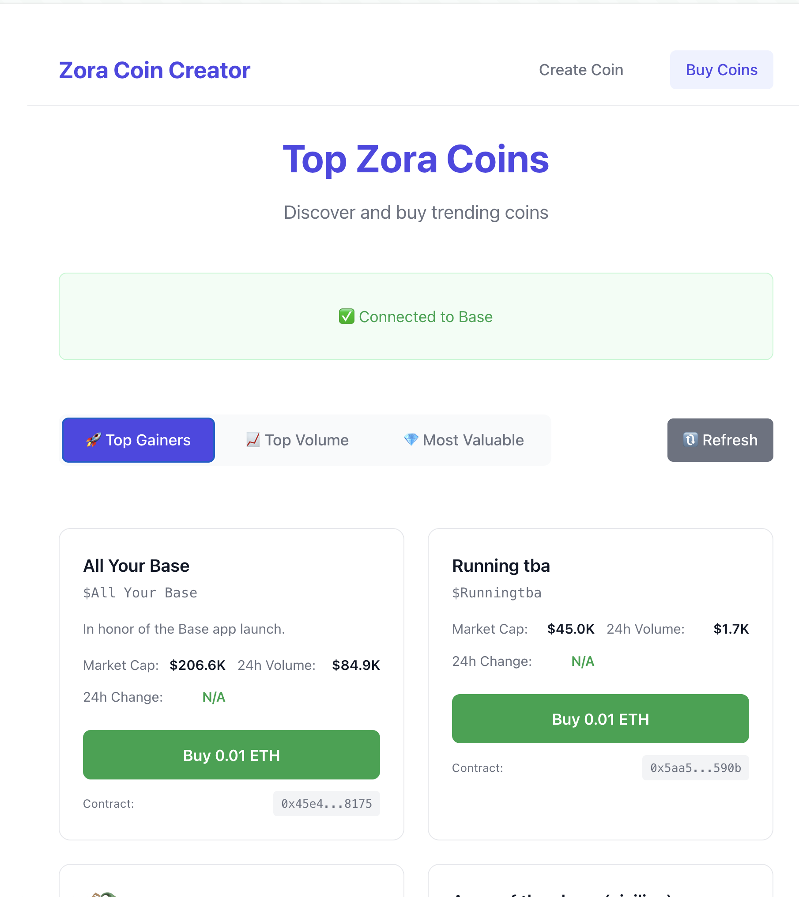
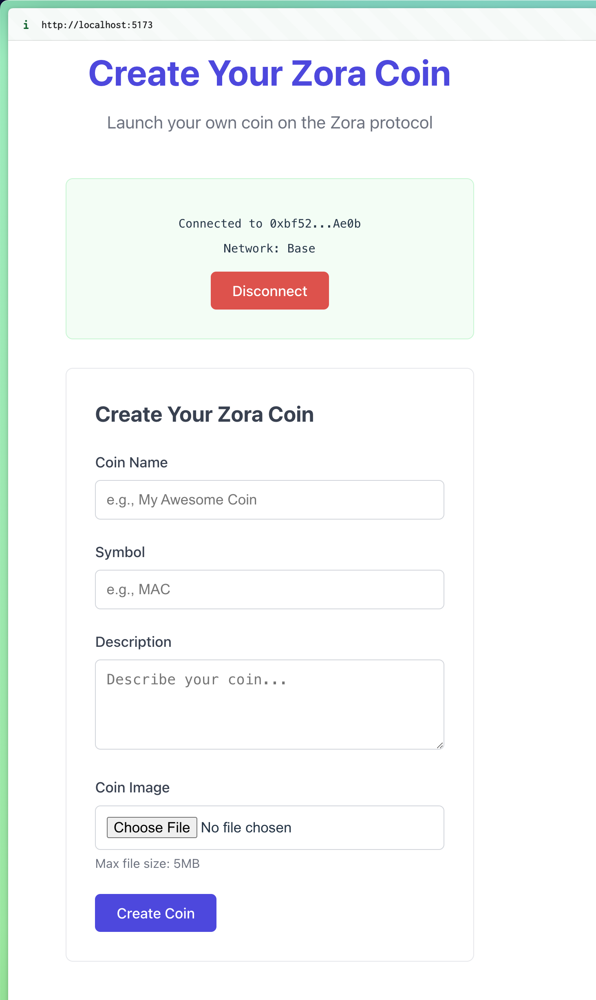

This is a repository of demo applications on the ZORA coins SDK.

These are not production ready and should be used as example projects for https://docs.zora.co/coins/sdk

### `zora-coin-creator`

Demo app for creating and buying top wallets with a connected EOA using react, the ZORA coins SDK created with claude code including a todo list and included logs.

*tip:* try asking "can all docs for the ZORA SDK be limited to the "https://docs.zora.co/" pages" to not accidentally include results for older versions of the ZORA SDK.
